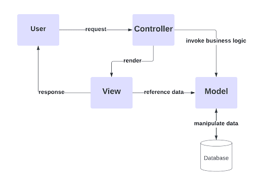
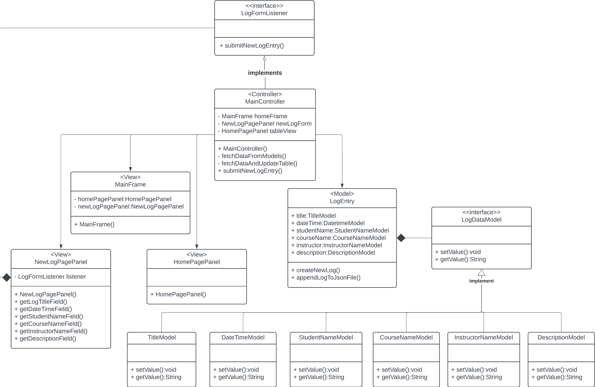

# Tutoring Log Application using MVC Pattern

<strong>MVC pattern</strong> divides the application into three interconnected components: Model, View, and Controller, each with distinct responsibilities.

### Model
- Represents the application's data and business logic.
- Contains the core functionalities and data structures.
- Notifies the View of changes to its data.

### View
- Represents the UI of the application.
- Displays data to the user and sends user input to the controller.
- Observes the Model to update the UI when data changes.

### Controller
- Acts as an intermediary between the Model and the View.
- Handles user input, processes it, and returns the output display.

## Generic UML Diagram

## UML diagram for the application

# Real World Use Cases of MVC Pattern

### Web Applications
- Django, Flask (Python)
- Spring MVC (Java)
- ASP.NET MVC (.NET)
- Ruby on Rails (Ruby)

### Mobile Applications
- iOS SDK
- Android SDK

### Desktop Applications
- GTK+ (C++)
- Qt (C++)
- wxWidgets (C++)
- JavaFX (Java)
- .Net WinForms / WPF (C#)

---

&copy; All Rights Reserved. | 2024 Hiromi Honda